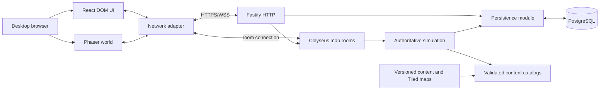

# Gameish Product and Delivery Plan

Status: Approved for implementation by the repository owner on 2026-07-14.

Last approved: 2026-07-14

## Authority and scope control

This document is the source of truth for product scope, architecture, milestones, and completion. `AGENTS.md` defines repository working rules, and `docs/architecture/` records the reasons behind major technical decisions.

The repository is a greenfield application repository containing planning documentation only. Git is initialized; no application packages, dependencies, runtime configuration, game assets, or tests exist yet.

Application implementation is authorized and must proceed through the ordered GitHub issues, starting only when an issue's blockers are complete. Scope may not be expanded silently: a proposed expansion must first document what changes, why it is necessary, its risks, and its effect on milestones and acceptance criteria, and then receive explicit approval.

## Product definition

Gameish is an original, browser-first, 2D side-view multiplayer action RPG for desktop keyboard-and-mouse players. Maps are horizontally composed side-view spaces with a defined walkable ground region: players move freely along the horizontal axis and shallowly along the vertical axis for positioning and visual depth. It is not a top-down, isometric, or platforming game. It aims to make cooperative play approachable without exposing server lists, room identifiers, or MMO infrastructure terminology.

References to existing games describe only the broad category. Protected names, characters, maps, stories, classes, interface designs, animations, assets, and other distinctive intellectual property must not be copied. The final world, class, characters, monsters, items, story, visual language, and terminology must be original.

### Target player

A desktop-browser player who wants a friendly cooperative RPG with direct controls, short activities, visible progression, and low social or technical friction.

### Core fantasy

Become a distinctive adventurer in an evolving world, help local characters, master one class, collect equipment that visibly changes the character, and naturally cooperate with nearby players.

### Core loop

1. Discover a need or destination.
2. Accept a quest.
3. Travel through an authored world.
4. Fight monsters alone or cooperatively.
5. Receive personal rewards and shared quest progress.
6. Improve power or appearance.
7. Return, complete the story beat, and discover the next activity.

### Approved product decisions

| Area             | Decision                                                                                                                             |
| ---------------- | ------------------------------------------------------------------------------------------------------------------------------------ |
| Perspective      | 2D side-view with limited planar movement: horizontal traversal plus shallow vertical positioning inside each map's defined walkable ground region; characters rendered from a side or three-quarter-side perspective; explicitly not top-down, isometric, or platforming |
| Combat           | Target-based hotbar with one basic attack and four class abilities                                                                   |
| World            | Compact authored areas joined by natural transitions                                                                                 |
| Region           | One North American deployment initially                                                                                              |
| Public maps      | Hidden automatic instances, configurable around a 20–30 player target                                                                |
| Parties          | Up to four players; coordinated travel must not silently split a party                                                               |
| Chat             | Map chat behind a feature flag; controlled testing only until moderation policy exists                                               |
| Accounts         | Browser-bound guests plus deterministic development login behind an explicit development gate                                        |
| Maps/content     | Tiled maps and validated, version-controlled content files                                                                           |
| Character art    | One canonical rig with replaceable raster sprite sheets                                                                              |
| Facing           | Left and right rendered facing for the slice; west may mirror east; vertical movement keeps the current horizontal facing; manifests may later add three-quarter variants |
| Ability movement | Movement normally remains available; individual abilities may define cast or recovery locks                                          |
| Shared credit    | Nearby active participants qualify; eligible nearby party members need not land the final hit; AFK or distant players do not qualify |
| Guest recovery   | Losing the browser credential loses access during this slice; named-account recovery is deferred                                     |
| Local budget     | $0 for local development; reliable external testing requires paid hosting                                                            |
| Devices          | Desktop keyboard and mouse; mobile gameplay and gamepad support are deferred                                                         |
| Real money       | Excluded                                                                                                                             |

The original class fantasy and combat feel are bounded content decisions to be made within the approved one-class and five-action scope. They do not authorize new mechanics or more content.

## Player experience

### First-session journey

1. Open the site.
2. Create or restore a guest identity.
3. Create or select one character.
4. Enter the village without choosing a server or instance.
5. Learn movement and interaction contextually.
6. Speak to a quest giver and accept a forest quest.
7. Follow optional guidance toward the forest.
8. Cross a natural map transition.
9. Encounter other players and server-controlled monsters.
10. Use the basic attack and four class abilities.
11. Receive personal loot and shared quest progress.
12. Equip armor and see the appearance change locally and for other players.
13. Return to the quest giver and complete the quest.
14. Reload and resume with durable progress intact.

### Returning-player loop

- Resume at the last valid logical location or safe spawn.
- Check tracked quests and nearby activities.
- Complete a short activity alone or cooperatively.
- Improve character level, equipment, or appearance.
- Leave with all durable progress committed.

### Controls

- `WASD` or arrow keys: move.
- Pointer click: select a target or interface element.
- `Tab`: cycle nearby hostile targets.
- `1`: basic attack.
- `2`–`5`: four class abilities.
- `E`: interact.
- `I`: inventory and equipment.
- `Q`: quest tracker/log.
- `M`: map.
- `Esc`: close the active panel or menu.
- `Enter`: open chat only when chat is enabled.

Bindings must be centralized even though remapping UI is deferred. Hover must never be the only way to discover an action.

### Accessibility baseline

- Semantic DOM menus with predictable keyboard focus.
- Text scaling independent of the game world.
- Color is never the only carrier of meaning.
- High-contrast target, quest, range, and interaction feedback.
- Reduced-motion and screen-shake settings plus flash-intensity limits.
- Separate music, effects, and interface volume controls.
- Readable cooldown, resource, rejection, dialogue, and combat feedback.
- Persistent control hints that can be disabled.
- No mandatory precision clicking or time-critical text reading.

## Vertical-slice scope

The approved slice includes:

- One village and one forest combat map.
- One original class with one basic attack and four distinct abilities.
- Two NPC roles: quest giver and shopkeeper.
- Three regular monster types and one elite or boss.
- Five small quests using kill, speak, visit, interact, and collect objectives.
- Ten to fifteen items.
- One visible armor set.
- Character level, experience, soft currency, inventory, equipment, quest state, discoveries, and logical location.
- Guest identity and persistent character creation/selection.
- Shared public-map presence.
- Individual rewards and shared quest credit.
- Four-player parties, cohesive travel, and travel-to-party-member.
- Hidden automatic public-map overflow.
- Short room reconnection and long logical-location recovery.
- Inventory, equipment, quest tracker, local/world map, shop, onboarding, and accessibility settings.
- Feature-flagged map chat for controlled environments.

Hidden instancing and parties are part of the approved definition. If scope must shrink, they are the first candidate reduction, but removing them requires an explicit amendment to this plan and its acceptance criteria.

### Explicit non-goals

- Mobile gameplay or gamepad support.
- PvP, guilds, friends/social graphs, trading, crafting, housing, or auctions.
- Real-money purchases.
- Multiple regions, seamless open world, or multi-process placement.
- Multiple classes, body rigs, or production skeletal animation.
- Procedural maps or user-generated content.
- Voice chat or unrestricted public text chat.
- A public moderation platform or admin content editor.
- Named-account recovery or guest conversion UI.
- Private dungeons, although placement boundaries must not prevent them later.
- Redis, queues, workers, microservices, Kubernetes, or an event bus.

## Architecture

### Approved stack

- TypeScript throughout the browser, server, shared contracts, content tools, and tests.
- Phaser 4 for the side-view world renderer, pinned after a compatibility spike.
- React DOM for menus, dialogue, inventory, maps, chat, accessibility, and account screens.
- Vite for browser development and production builds.
- Colyseus over its standard WebSocket transport for rooms, synchronization, matchmaking, and reconnection, pinned after per-client filtering is proven.
- Fastify HTTP routes attached to the same Node HTTP server as Colyseus.
- PostgreSQL for durable player state.
- Drizzle for TypeScript schema, reviewed SQL migrations, queries, and transactions.
- Zod for content, configuration, HTTP, and inbound message validation.
- Tiled JSON sources compiled into separate client-rendering and server-geometry artifacts.
- pnpm workspaces, Docker Compose, Vitest, Playwright, real PostgreSQL integration tests, and headless multiplayer clients.

Exact runtime versions are chosen and pinned in the first implementation issue after documented compatibility checks. Approval of the stack does not waive those checks.

### System shape



One Node deployable initially owns HTTP, authentication coordination, placement, map-room lifecycle, authoritative simulation, and persistence coordination. These remain deep internal modules rather than separate services.

### Repository boundaries

The intended workspace boundaries are:

- `apps/web`: Phaser world, React UI, client networking, input, local prediction, interpolation, and development overlays.
- `apps/server`: HTTP, authentication, placement, rooms, simulation, persistence coordination, security, and observability.
- `packages/protocol`: only network-shared identifiers, payload contracts, public state shapes, and stable error codes.
- `packages/content`: schemas, canonical definitions, reference validation, client/server catalog compilation, and Tiled sources.
- `packages/world`: pure deterministic geometry, collision, and movement shared by authority and prediction.
- `packages/database`: schema, reviewed migrations, repositories, atomic transactions, and seeds.
- `tests`: cross-application multiplayer, browser, load, security, and restart validation.
- `tools`: content, map, and asset validation/compilation.

There is no generic `shared`, `utils`, or `services` dumping ground. Dependencies must point toward stable domain boundaries; the browser never imports server or database modules.

### Responsibility boundaries

The browser may:

- Capture movement and action intentions.
- Predict only its own movement.
- Interpolate remote entities.
- Render maps, entities, equipment, effects, authoritative results, and local UI state.

The browser may not calculate final damage, healing, rewards, cooldown completion, eligibility, purchases, quest transitions, or inventory mutation.

The game server must:

- Authenticate room entry and consume short-lived one-time tickets.
- Select hidden instances and reserve party capacity.
- Run fixed-step simulation initially at 20 Hz.
- Enforce movement speed, collision, targeting range, cooldowns, resources, and action rates.
- Control monsters, participation, quest credit, personal loot, deaths, and respawns.
- Complete durable transactions before reporting success.
- Filter private and public state and keep infrastructure identifiers out of normal payloads.

HTTP owns health/readiness, guest sessions, character list/create/select, play-ticket issuance, and client-safe version metadata. It does not carry real-time movement or combat.

PostgreSQL owns durable identities, sessions, characters, progression, currency, inventory, equipment, quests, discoveries, transaction audits, idempotency records, and last logical location. It is not the live simulation store, and movement is not written every tick.

### Identity and room entry

1. The browser requests or restores a guest session.
2. The server stores an opaque session secret only as a secure hash and sends the credential in an `HttpOnly`, `Secure`, `SameSite` cookie.
3. The player creates or selects a character.
4. The browser requests a short-lived, one-time play ticket bound to user, character, logical destination, content version, expiry, and nonce.
5. Colyseus authentication consumes the ticket exactly once.

Client and API must be same-origin or use same-site subdomains behind an approved deployment shape. Development login exists only under an explicit development gate and must be impossible in production mode.

### Networking and simulation

- Clients send normalized movement intention, not final coordinates.
- The server integrates authoritative movement and collision and acknowledges processed input sequence numbers.
- The local client predicts with the shared pure world module and reconciles beyond a measured tolerance.
- Remote players interpolate behind the newest state.
- The client estimates server-time offset for telegraph timing.
- Ability intentions carry action IDs; server time controls cooldowns and injected seeded RNG controls deterministic tests.
- Targeting is range-based in this slice. Line-of-sight raycasting is deferred.
- A stale content version rejects room entry with `STALE_CONTENT_VERSION` and asks the client to reload.

Public state contains only what nearby players need to render and understand the map: ephemeral entity identity, display name, position, facing, animation/combat state, appearance summary, and appropriate health/resource fractions.

Private state includes exact account/character identity, inventory, currency, quest log, loot, purchase results, eligibility failures, and cooldown/resource corrections. User IDs, session credentials, internal room IDs, full inventories, full quest state, private loot, hidden monster state, and debug information must never be broadcast.

### Persistence and idempotency

Persist immediately and transactionally:

- Character creation and starter state.
- Loot and quest reward grants.
- Quest completion.
- Equipment changes.
- Currency changes and purchases.
- Important progression changes.

Checkpoint logical map, safe spawn, valid position, and disconnect state periodically and on lifecycle events. Rewards and purchases use idempotency keys. Database unavailability rejects durable mutations rather than reporting uncommitted success.

### Content and assets

Canonical content lives in validated, version-controlled files with stable namespaced string IDs and schema versions. Build and startup validation must reject duplicate IDs, missing references, incompatible assets, circular quest prerequisites, invalid portals, and unreachable required spawns.

Server catalogs contain hidden rules and rewards; client catalogs contain presentation-safe data only. Deployments publish immutable content artifacts identified by a content version.

Tiled maps are authored as horizontally composed side-view spaces and provide explicit render layers plus collision, navigation, spawn, portal, and interaction data. Each map defines a walkable ground region that bounds vertical positioning. Compilation emits client rendering artifacts and minimal server geometry/metadata artifacts.

Character art uses a manifest-defined rig, origin, attachments, facing, animation names, layer ordering, and fallbacks. Placeholder sheets use side-view raster animation with left/right facing; west may mirror east. Gameplay talks to a narrow character-renderer interface so a future renderer can replace the compositor without changing combat or equipment rules.

Every non-original asset records license, provenance, source, export tool/version, rig version, dimensions, frame arrangement, and compatibility metadata. Protected games must not be placed in prompt or asset-reference folders.

## Milestones

### M0 — Approved foundation

Result: a runnable browser shell and distinguishable server/database health, with pinned tools, validation commands, CI lanes, PostgreSQL development setup, and documented Phaser/Colyseus spike evidence.

Gate: a fresh clone can install, validate, test, and build; invalid sample content fails usefully; compatibility ADRs or amendments record any fallback.

### M1 — Offline authored world

Result: a placeholder layered character walks a validated village map with camera, collision, facing, depth ordering, resizing, and keyboard-accessible UI focus.

Gate: movement is frame-rate independent; boundaries cannot be crossed; map and asset contract violations fail validation; production build remains playable.

### M2 — Multiplayer presence and resilience

Result: two browser sessions see authoritative movement and public appearance, remain convergent under simulated latency, and recover from short disconnects.

Gate: excessive speed is rejected; internal room identity appears only in development overlays; a ten-minute two-client soak has no growing divergence or stale entity.

### M3 — Authoritative cooperative combat

Result: the class fights server-controlled monsters with all five actions, telegraphs, participation, and private individual rewards.

Gate: clients cannot forge outcomes; all actions have distinct deterministic tests; two players can cooperate; spectators and AFK players do not receive credit.

### M4 — NPCs and quests

Result: an accessible NPC conversation leads through all approved objective types, optional guidance, shared progress, and a complete in-memory quest loop.

Gate: invalid and duplicate transitions are harmless; eligible participants progress; distant/uninvolved players do not; guidance can be disabled.

### M5 — Guest identity and durable progress

Result: guest character creation/selection and all approved progress survive reloads and server/database restarts through atomic Drizzle/PostgreSQL operations.

Gate: replayed reward IDs do not duplicate outcomes; concurrent operations preserve constraints; development login is unavailable in production mode.

### M6 — Inventory and visible equipment

Result: a player obtains, previews, equips, and removes armor; the persistent appearance updates locally and for other players.

Gate: only owned eligible items equip; mutations are atomic; missing assets degrade safely; compatible art can be replaced without gameplay changes.

### M7 — Natural travel, hidden instancing, and parties

Result: village/forest travel uses natural exits, automatic overflow, party reservations, cohesive transitions, travel-to-member, maps, and short/long recovery.

Gate: normal UI exposes no room selector or internal ID; full instances overflow; parties do not silently split; invalid/locked transitions fail safely; disposed-room recovery retains logical location.

### M8 — Complete content and onboarding

Result: the full bounded content inventory, shop, feature-flagged chat, accessibility baseline, and fourteen-step first session work as a coherent build.

Gate: content counts and references validate; a fresh tester completes the journey without developer help; chat follows the approved environment policy.

### M9 — Stabilized external build

Result: a secure, measured, observable North American deployment with backup, restore, rollback, and graceful room-draining procedures.

Gate: no known critical security or consistency issue; capacity is measured on stated hardware; deploy/rollback/restore are rehearsed; an external tester completes the production journey.

## Acceptance criteria

The vertical slice is accepted only when all of the following are true:

- A new desktop-browser player enters as a guest and creates or selects one persistent character.
- They enter the village without selecting a server or instance.
- Authoritative collision works and another player is visible.
- The quest giver provides an accessible quest flow and optional forest guidance.
- Natural travel enters the forest without exposing room identity.
- The class fights server-controlled monsters with one basic attack and four distinct abilities.
- At least two players can cooperate; eligible active players receive shared quest credit and independent rewards.
- Armor can be obtained and equipped, and the change persists and appears to other clients.
- The quest can be completed and its rewards cannot be duplicated.
- Approved progression, inventory, equipment, quests, currency, discoveries, and location survive reload and restart.
- Full maps overflow invisibly and coordinated party travel does not silently split the party.
- Short reconnection restores the live entity when possible; long recovery returns to a valid logical map and safe spawn.
- The exact approved content inventory exists and validates.
- Chat is disabled by default outside controlled approved environments.
- The complete automated validation suite passes.
- No known critical security or data-consistency defect remains.
- An uninstructed external tester completes the production journey.

## Testing strategy

### Test layers

- **Unit:** deterministic movement, collision, combat, quest state, eligibility, placement, validation, and pure content transformations.
- **Contract:** Zod payloads, stable IDs, public/private state shapes, error codes, content references, map contracts, and asset manifests.
- **Integration:** real PostgreSQL migrations, repositories, transactions, constraints, idempotency, concurrency, and HTTP/session lifecycle.
- **Multiplayer:** headless clients for joins, authority, latency, reconnection, shared credit, private rewards, party races, capacity, and transitions.
- **Browser:** Playwright for keyboard/focus, movement smoke, two-context presence, inventory/equipment, maps, shop, guidance variants, and the fourteen-step journey.
- **Content/asset:** build-time validation plus structural or targeted visual snapshots for layer ordering and missing fallbacks.
- **Restart/recovery:** server restart, database restart, room disposal, invalid saved location, migration rehearsal, backup restore, and rollback.
- **Security:** hostile payloads, origin/session checks, rate limits, replayed tickets/actions, production feature gates, secret scanning, and dependency scanning.
- **Performance:** client load/FPS/long frames, fixed-tick duration, event-loop lag, message volume, representative load, and soak tests.

Production randomness must be injectable and seeded in tests. Tests must assert externally meaningful behavior and invariants rather than private implementation details. Manual checks supplement but never replace automatable acceptance criteria.

### Required validation commands after foundation exists

```text
pnpm validate
pnpm lint
pnpm format:check
pnpm test
pnpm test:integration
pnpm test:multiplayer
pnpm test:e2e
pnpm build
```

Changes run the smallest relevant command during iteration and all applicable commands before handoff. The exact scripts are established in M0 and then treated as stable repository interfaces.

## Risk register

| Risk                      | Likelihood | Impact | Mitigation and evidence                                                                                 |
| ------------------------- | ---------- | ------ | ------------------------------------------------------------------------------------------------------- |
| Browser rendering cost    | Medium     | High   | Culling, bounded atlases/effects, texture budgets, reference-hardware profiling in M1/M8/M9             |
| Synchronization jitter    | High       | High   | Fixed tick, prediction/reconciliation/interpolation, latency and soak tests in M2                       |
| Client cheating           | High       | High   | Intention-only protocol, authority, validation, rate limits, and rejection tests in M2/M3/M9            |
| Database inconsistency    | Medium     | High   | Constraints, atomic transactions, revisions, idempotency, and concurrency tests in M5                   |
| Reconnection defects      | High       | High   | Separate short-room and long-location recovery tests in M2/M7/M9                                        |
| Content complexity        | High       | High   | Limited vocabulary, stable IDs, immutable catalogs, templates, and reference validation from M0 onward  |
| Art-pipeline complexity   | High       | High   | One rig, manifest contract, aligned placeholders, fallbacks, and replacement test in M1/M6              |
| Scope creep               | High       | High   | Bounded inventory, explicit non-goals, milestone gates, and mandatory documented approval for expansion |
| Accessibility regressions | Medium     | High   | DOM UI, focus/keyboard checks, contrast/motion settings, and journey variants in M1/M8/M9               |
| Security and abuse        | Medium     | High   | Secure sessions, one-time tickets, origin checks, gated chat, threat model, and hostile-input tests     |
| Phaser 4 maturity         | Medium     | Medium | Pin only after M0 map/rendering spike; isolate renderer boundary and record fallback                    |
| Colyseus churn/filtering  | Medium     | High   | Pin after M0 per-client filtering spike; document upgrade path and private-state tests                  |
| IP similarity             | Medium     | High   | Original briefs, provenance/license records, no protected references, and content review                |
| Hosting cost/reliability  | Medium     | Medium | One process/region, measured sizing, paid external environment, backups, and no premature distribution  |
| Solo-maintainer overload  | High       | High   | Deep modules, ordered tracer-bullet issues, runnable milestones, and no speculative infrastructure      |

## Deferred features

- Final game name and production visual style.
- Three-quarter or additional-facing production animation if left/right facings suffice.
- Skeletal animation and alternative character renderer.
- Mobile, gamepad, and native packaging.
- Named accounts, recovery, and guest conversion.
- More classes, maps, regions, quests, items, rigs, and progression systems.
- Friends, guilds, trading, PvP, crafting, housing, auctions, and real-money monetization.
- Public chat moderation, voice chat, and extensive social graphs.
- Admin authoring tools, procedural content, and user-generated content.
- Private dungeons.
- Redis, horizontal scaling, managed PostgreSQL, and multi-region placement.
- Line-of-sight combat validation, projectile physics, and complex threat systems.
- Analytics warehouse and advanced live operations.

Deferred features are not implicit follow-up work. Moving one into scope requires the scope-control process at the top of this document.

## Definition of done

A ticket is done when:

- Its user-visible or independently verifiable outcome works end to end.
- Its issue acceptance criteria, automated tests, and manual checks pass.
- Relevant validation commands pass with no unexplained skip.
- Server-authority, privacy, security, accessibility, and content boundaries remain intact.
- New content/assets validate and include required provenance.
- Any architecture change updates or supersedes the applicable ADR.
- Any approved scope change updates this plan before implementation.
- Documentation explains non-obvious operation or recovery behavior.
- No debug-only capability can activate under production configuration.
- The repository remains runnable for the next independently reviewable ticket.

The vertical slice is done only when all milestone gates and vertical-slice acceptance criteria pass in a production build, deployment/recovery procedures have been rehearsed, and an external tester completes the journey without developer intervention.

## Implementation authorization

The repository owner explicitly approved these planning documents and authorized application implementation on 2026-07-14. Work may begin with the first unblocked `ready-for-agent` issue and must continue in dependency order under `AGENTS.md`.
