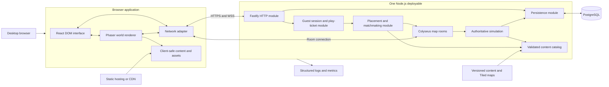

# Browser-first multiplayer RPG implementation plan

Status: Planning draft for review. Implementation is not approved by this document.

This project is an original browser-first 2D multiplayer action RPG. References to other games describe only the broad category of an accessible, social browser RPG. Protected names, characters, assets, maps, interface designs, classes, stories, animations, and other intellectual property must not be copied.

## Confirmed decisions

| Decision | Status |
|---|---|
| Perspective | Top-down |
| Combat | Target-based hotbar: basic attack plus four abilities |
| World structure | Compact authored areas connected by natural transitions |
| Initial region | North America |
| Party/instance targets | Provisionally 4-player parties; 20–30 players per public instance |
| Chat | Feature-flagged; controlled testing only initially |
| Character art | One canonical rig for the vertical slice |
| Initial animation | Replaceable raster sprite sheets |
| Accounts | Browser-bound guests plus deterministic development login |
| Content workflow | Tiled maps plus validated, version-controlled content files |
| Initial budget | $0 during local development |
| Real-money systems | Not included |
| Primary devices | Provisionally desktop keyboard and mouse |
| Mobile/gamepad | Deferred |

## Repository assessment

The workspace is greenfield:

- The workspace contained only this plan document plus empty `.agents` and `.codex` directories.
- No Git metadata existed.
- There were no commits, source files, assets, manifests, dependencies, tests, or configuration.
- Nothing was reusable.
- No technology conflicts existed.
- All stack and repository decisions remained open.

After plan approval, Git initialization and operational documents should precede implementation.

## Remaining product questions

These do not block the architecture, so the plan uses provisional answers:

- Character facing: four-direction animation for the slice, with east/west mirroring permitted. Eight-direction assets remain supported by manifests.
- Ability movement: movement remains available during most abilities; individual abilities may define cast or recovery locks.
- Shared quest credit: active nearby participants receive credit; nearby party members may receive credit without landing the final hit, but AFK characters do not.
- Guest recovery: losing the browser credential loses access until account conversion exists.
- Production budget: a paid deployment becomes necessary before reliable external testing.

The final creative identity—world name, class fantasy, visual style, story, characters, monsters, and item designs—remains a creative decision, not a technical one.

## Architecture options

### Option A — Phaser and TypeScript modular monolith

Main technologies:

- Phaser 4 with TypeScript.
- React-rendered DOM interface over the game canvas.
- Vite.
- Colyseus WebSockets and room simulation.
- Fastify HTTP routes in the same Node process.
- PostgreSQL with Drizzle.
- Zod for HTTP, content, configuration, and inbound message validation.
- Vitest, Playwright, Docker Compose, and pnpm workspaces.

Phaser is explicitly a browser-focused 2D framework, supports TypeScript, and has native Tiled tilemap support. Phaser 4 is a comparatively recent major generation, so it should be version-pinned and validated in Milestone 0. See the [Phaser overview](https://docs.phaser.io/), [Phaser 4.2 release](https://phaser.io/news/2026/06/phaser-v4-2-0-released), and [Phaser tilemaps](https://docs.phaser.io/api-documentation/class/tilemaps-tilemap).

Advantages:

- Best browser fit.
- End-to-end TypeScript contracts.
- Fast iteration and strong AI-agent navigability.
- Small deployable footprint.
- DOM menus provide better accessibility than canvas-only UI.
- Phaser handles cameras, input, animation, tilemaps, and rendering.
- Colyseus provides room lifecycle, state patches, matchmaking, and reconnection instead of requiring custom infrastructure. See [Colyseus state synchronization](https://docs.colyseus.io/state), [matchmaker](https://docs.colyseus.io/matchmaker), and [reconnection](https://docs.colyseus.io/room/reconnection).

Disadvantages:

- Phaser 4 is newer than Phaser 3 and has less accumulated ecosystem maturity.
- DOM/Phaser state requires a deliberate interface.
- Server collision and simulation cannot reuse Phaser physics.
- Layered sprite animation still needs a custom compositor.

Complexity and hosting:

- Moderate development complexity.
- Low hosting complexity.
- One Node process and one PostgreSQL database initially.
- Best overall fit for a solo creator and AI-assisted maintenance.

Future limitations:

- Very large seamless worlds would require map streaming work.
- Extremely action-heavy combat may eventually need a higher server tick rate.
- Advanced skeletal animation needs a renderer adapter later.

### Option B — Godot web client with a separate authoritative server

Main technologies:

- Godot 4 client using GDScript.
- Godot web export.
- Node/Colyseus or a separate Godot headless server.
- PostgreSQL.

Advantages:

- Strong visual editor, scene composition, animation, navigation, and 2D tooling.
- Good native desktop/mobile path.
- Skeletal animation and richer scene workflows are more integrated.

Disadvantages:

- No TypeScript sharing between client and Node server.
- Godot 4 C# projects cannot currently target web.
- Web export requires WebAssembly and WebGL 2; multithreaded export adds cross-origin-isolation requirements, while single-threaded export trades away performance.
- Browser background suspension can interrupt networked games.
- DOM account and accessibility interfaces are less natural.
- Larger initial payload and slower browser startup.

Godot documents these web constraints directly, including WebGL 2, C# limitations, thread/header trade-offs, and restricted browser networking. See [Godot web export](https://docs.godotengine.org/en/stable/tutorials/export/exporting_for_web.html).

Suitability:

- Good art pipeline.
- Acceptable multiplayer client.
- Weaker browser-first and shared-code fit.
- Higher maintenance burden because the system spans GDScript and TypeScript.
- Better choice only if Godot’s editor becomes a decisive creative requirement.

### Option C — PixiJS and custom TypeScript game framework

Main technologies:

- PixiJS.
- Custom scene, map, collision, animation, and input modules.
- Colyseus, Fastify, PostgreSQL, and Drizzle.

Advantages:

- Excellent browser rendering.
- Full TypeScript sharing.
- Maximum control over layered characters and custom visual workflows.
- Potentially smaller runtime than a full game framework.

Disadvantages:

- PixiJS is explicitly a rendering engine, not a complete game engine.
- Cameras, collision, tilemaps, animation state, interaction, asset conventions, and debugging require more custom code. See the [PixiJS ecosystem](https://pixijs.com/8.x/guides/getting-started/ecosystem) and [renderer guide](https://pixijs.com/8.x/guides/components/renderers).
- More defects and maintenance work land on the solo creator.
- Slower path to the first playable slice.

Suitability:

- Excellent browser and multiplayer compatibility.
- Potentially excellent art pipeline.
- Highest engineering burden.
- Worth revisiting only if Phaser imposes a concrete rendering limitation.

### Recommendation

Choose Option A.

Use:

- Phaser 4, pinned to a verified stable release.
- React DOM for menus, dialogue, inventory, maps, chat, accessibility, and account screens.
- Colyseus using its standard `ws` transport.
- Fastify attached to the same Node HTTP server.
- PostgreSQL with Drizzle-generated, reviewed SQL migrations.
- Zod for explicit contracts.
- No Redis, workers, queues, Kubernetes, microservices, or event bus.

Fastify exposes its underlying Node server, and Colyseus can reuse a Node HTTP server, allowing HTTP and WebSocket concerns to coexist in one process. See the [Fastify server interface](https://fastify.dev/docs/latest/Reference/Server/) and [Colyseus WebSocket transport](https://docs.colyseus.io/server/transport/ws).

Drizzle is preferred over Prisma because the schema remains TypeScript-native while generated SQL migrations stay visible and reviewable. Both support transactions, but Drizzle introduces less separate schema machinery for this small system. See [Drizzle migrations](https://orm.drizzle.team/docs/migrations), [Drizzle transactions](https://orm.drizzle.team/docs/transactions), and the [Prisma overview](https://www.prisma.io/docs/orm).

## Product specification

### Target player

A desktop-browser player who wants an approachable cooperative RPG without learning server lists, room identifiers, MMO terminology, or complicated controls.

### Core player fantasy

Become a distinctive adventurer in a friendly evolving world, help local characters, master a class, collect visually meaningful equipment, and naturally encounter other players.

### Core loop

1. Discover a need or destination.
2. Accept a quest.
3. Travel through the world.
4. Fight monsters alone or cooperatively.
5. Receive personal rewards and shared progress.
6. Improve the character’s power or appearance.
7. Return, complete the story beat, and discover the next activity.

### First session

1. Open the site.
2. Create a guest identity.
3. Create or select one character.
4. Enter the village near the quest giver.
5. Learn movement and interaction contextually.
6. Accept a forest quest.
7. Follow optional guidance.
8. Cross a natural map transition.
9. Encounter other players and monsters.
10. Use the basic attack and abilities.
11. Receive individual loot and shared quest progress.
12. Equip armor and see the appearance change.
13. Return and complete the quest.
14. Reload and resume with progress intact.

### Returning-player loop

- Resume near the last safe location.
- Check tracked quests or available NPC indicators.
- Complete a short activity.
- Improve class progression, equipment, or appearance.
- Join a party or naturally cooperate.
- Leave with all durable progress committed.

### Social loop

- See players in shared public maps.
- Cooperate without competing for monster tags or floor loot.
- Form parties of up to four.
- Keep parties together through travel.
- Travel to an eligible party member.
- Use feature-flagged map chat in controlled environments.

### Progression loop

Vertical-slice progression includes:

- Character level and experience.
- One class and its ability loadout.
- Soft currency.
- Inventory and equipment.
- Quest completion.
- Discovered locations.
- Visible armor appearance.

Class-specific progression can exist conceptually but should be minimal with only one class.

### Initial controls

- `WASD` or arrow keys: move.
- Pointer click: select target or interface element.
- `Tab`: cycle nearby hostile targets.
- `1`: basic attack.
- `2–5`: four class abilities.
- `E`: interact with nearby NPC or object.
- `I`: inventory and equipment.
- `Q`: quest tracker/log.
- `M`: map.
- `Esc`: close panel/menu.
- `Enter`: chat when enabled.
- Pointer hover is never the sole means of discovering an action.

Controls must be remappable eventually; the first implementation should at least centralize bindings.

### Accessibility principles

- DOM-based semantic menus with keyboard focus.
- Text scaling without scaling the game world.
- Color never carries meaning alone.
- High-contrast target, quest, and interaction indicators.
- Reduced-motion and screen-shake settings.
- Flash-intensity limits.
- Separate music, effects, and interface volume.
- Clear cooldown, range, resource, and rejection feedback.
- Persistent control hints that can be disabled.
- No mandatory precision clicking.
- No time-critical text reading.
- Dialogue and combat feedback remain readable at common desktop resolutions.

### Explicit non-goals

- Mobile gameplay.
- Gamepad support.
- PvP.
- Guilds.
- Trading.
- Crafting.
- Housing.
- Auction houses.
- Friend lists or extensive social graphs.
- Real-money purchases.
- Multiple regions.
- Seamless open world.
- Multiple body rigs.
- Procedurally generated maps.
- User-generated content.
- Voice chat.
- Public chat moderation platform.
- Admin content editor.
- Private dungeons, although the placement design must allow them later.

## System architecture



### Client responsibilities

- Capture movement and action intentions.
- Predict local movement only.
- Interpolate remote entities.
- Render maps, players, monsters, NPCs, equipment, and effects.
- Display authoritative combat, inventory, quest, and error results.
- Manage local UI state, settings, and cached assets.
- Never calculate final damage, rewards, cooldown completion, eligibility, purchases, or inventory mutations.

### Game-server responsibilities

- Authenticate room entry.
- Select and operate hidden map instances.
- Run fixed-step map simulation.
- Enforce movement speed and collision.
- Control monsters, aggro, abilities, deaths, and respawns.
- Validate targeting, range, resources, and cooldowns; targeting validation is range-based for the vertical slice.
- Determine participation, quest credit, XP, currency, and loot.
- Coordinate durable transactions.
- Filter what each player receives.
- Keep internal room identifiers out of normal interface payloads.

### HTTP responsibilities

- Health/readiness.
- Guest session creation.
- Character listing, creation, and selection.
- Short-lived one-time play tickets.
- Static client-safe configuration or content version metadata.
- Development-only debug endpoints behind explicit environment gates.
- No real-time combat or movement.

### Database responsibilities

- Durable identities and sessions.
- Character state.
- Inventory, equipment, progression, quests, discoveries, and transaction audit.
- Idempotency records for durable rewards.
- Migrations and seed data.

PostgreSQL is not the live map simulation store.

### Content responsibilities

- Validate all definitions at startup and build time.
- Resolve stable string IDs.
- Build a server catalog containing hidden rules and rewards.
- Build a client-safe catalog containing presentation information.
- Parse Tiled maps into rendering and server geometry artifacts.
- Reject missing references, invalid portals, circular quest prerequisites, unreachable spawn points, and incompatible assets.

### Authentication flow

1. Browser requests a guest session.
2. Server creates a guest user and opaque session.
3. Credential is stored in an `HttpOnly`, `Secure`, `SameSite` cookie.
4. Browser requests character list.
5. Player creates or selects a character.
6. Server returns a short-lived, one-time play ticket.
7. Colyseus room authentication consumes that ticket.
8. The ticket binds user, character, logical destination, expiry, and nonce.
9. Development login exists only when an explicit development flag is active.

Because the session credential is a cookie, the client and the API must share an origin (for example behind one reverse proxy) or at minimum same-site subdomains. A deployment that serves the client and the API from unrelated origins makes the session cookie a third-party cookie that browsers will not send, breaking guest sessions.

No password or email system is required for the slice.

### Map-transition flow

1. Client sends `portal.use` with a portal content ID.
2. Server verifies proximity, eligibility, destination, and cooldown.
3. Placement module selects a destination instance.
4. Server reserves a seat and produces a transition ticket.
5. Current room checkpoints safe location and removes the player.
6. Client connects to the destination room.
7. Destination spawns the character at the named entrance.
8. UI displays only the destination’s world name—not internal room data.
9. Failure returns the player to the source room or safe spawn.

### Automatic-instancing flow

Placement priority:

1. Existing reconnect reservation.
2. Existing party-member instance with sufficient reserved capacity.
3. Party leader’s eligible destination.
4. Existing public instance below the soft population target.
5. Newly created public instance.
6. A fresh overflow instance if all existing ones are full.

Rules:

- Hard capacity is configurable per logical map.
- Party seat reservations are atomic.
- A party is never silently split during coordinated travel.
- Players entering independently may land in different instances.
- “Travel to party member” checks map eligibility and private-access rules.
- Future private dungeons use the same placement interface with an access scope.
- Internal identifiers may appear only in development overlays and logs.

### Combat-message flow

1. Client sends an ability intention with action sequence, ability slot, and target.
2. Server validates rate, state, target, distance, cooldown, resource, and control effects.
3. Server resolves the ability using server time and server RNG.
4. Simulation mutates health, resources, statuses, cooldowns, and threat.
5. Public combat events are broadcast.
6. Private resource/cooldown correction goes only to the acting player.
7. Death triggers participation calculation.
8. Durable rewards are written atomically.
9. Each eligible player receives a private reward result.
10. Quest progress changes are sent only to the affected character.

Targeting validation is range-based for the vertical slice. Line-of-sight raycasting is deferred; when introduced later, it would live in the shared `world` package alongside geometry and collision.

### Persistence flow

Persist immediately and transactionally:

- Loot awards.
- Purchases.
- Quest completion and rewards.
- Equipment changes.
- Currency changes.
- Important progression changes.

Checkpoint periodically or on lifecycle events:

- Logical map.
- Safe spawn.
- Position where safe.
- Health/resource state if the design chooses to retain them.
- Disconnect time.

Do not write movement every server tick.

### Reconnection flow

- Short interruption: Colyseus reconnect token restores the same live player entity within a grace window.
- Expired room reservation: create a new play ticket and place the character into the previous logical map.
- Dead or disposed room: choose another instance and use the last safe spawn.
- Invalid saved location: return to the village spawn.
- Client buffers no reward or combat intentions during disconnection.
- Reconnected clients receive a fresh full authoritative snapshot.

### Error handling

- Typed stable codes such as `ABILITY_ON_COOLDOWN`, `OUT_OF_RANGE`, `MAP_LOCKED`, `INSTANCE_UNAVAILABLE`, `STALE_CONTENT_VERSION`, and `STALE_CHARACTER_REVISION`.
- Expected domain errors do not produce stack traces for clients.
- Every request/action has a correlation or action ID.
- Unknown server errors log structured context and return a generic safe response.
- Reward uncertainty fails closed and is retried through idempotency keys.
- Database unavailability rejects durable mutations rather than pretending they succeeded.
- Client shows reconnection and retry states without exposing infrastructure terminology.
- Graceful shutdown rejects new joins, checkpoints characters, and asks clients to reconnect.

### Data placement

| Location | Data |
|---|---|
| PostgreSQL | Users, sessions, characters, appearance selections, progression, currency, inventory, equipment, quest state, discoveries, transactions, reward idempotency, last logical location |
| Server memory | Room entities, monster AI, positions, cooldown timers, statuses, aggro, spawn timers, reconnection leases, seat reservations, current inputs |
| Shared content | Classes, abilities, items, monsters, quests, maps, portals, NPCs, shops, encounter rules, progression curves, configuration |
| Client | Assets, client-safe presentation definitions, local settings, current UI state, prediction/interpolation buffers |
| Logs/metrics | Errors, joins, transitions, disconnects, performance, security rejections, sampled combat diagnostics; no unnecessary credentials or personal data |
| Redis later | Multi-process room presence, distributed matchmaking, cross-node reservations, party presence, shared rate limits; only once multiple server processes exist |

## Proposed repository structure

```text
gameish/
├── AGENTS.md
├── PLAN.md
├── README.md
├── package.json
├── pnpm-workspace.yaml
├── tsconfig.base.json
├── compose.yaml
├── .env.example
├── .editorconfig
├── .gitignore
├── apps/
│   ├── web/
│   │   ├── public/
│   │   │   └── assets/
│   │   ├── src/
│   │   │   ├── game/
│   │   │   │   ├── scenes/
│   │   │   │   ├── entities/
│   │   │   │   ├── rendering/
│   │   │   │   ├── input/
│   │   │   │   └── prediction/
│   │   │   ├── network/
│   │   │   ├── ui/
│   │   │   ├── debug/
│   │   │   └── main.tsx
│   │   └── tests/
│   └── server/
│       ├── src/
│       │   ├── bootstrap/
│       │   ├── auth/
│       │   ├── http/
│       │   ├── placement/
│       │   ├── rooms/
│       │   ├── simulation/
│       │   │   ├── movement/
│       │   │   ├── combat/
│       │   │   ├── monsters/
│       │   │   └── quests/
│       │   ├── persistence/
│       │   ├── observability/
│       │   └── debug/
│       └── tests/
├── packages/
│   ├── protocol/
│   │   └── src/
│   │       ├── ids/
│   │       ├── http/
│   │       ├── messages/
│   │       ├── state/
│   │       └── errors/
│   ├── content/
│   │   ├── src/
│   │   │   ├── schemas/
│   │   │   ├── loader/
│   │   │   └── compiler/
│   │   └── data/
│   │       ├── classes/
│   │       ├── abilities/
│   │       ├── effects/
│   │       ├── items/
│   │       ├── monsters/
│   │       ├── loot/
│   │       ├── npcs/
│   │       ├── dialogue/
│   │       ├── quests/
│   │       ├── shops/
│   │       ├── maps/
│   │       └── config/
│   ├── world/
│   │   └── src/
│   │       ├── geometry/
│   │       ├── collision/
│   │       └── movement/
│   └── database/
│       ├── src/
│       │   ├── schema/
│       │   ├── repositories/
│       │   ├── transactions/
│       │   └── seed/
│       └── migrations/
├── tests/
│   ├── multiplayer/
│   ├── e2e/
│   └── load/
├── tools/
│   ├── validate-content/
│   ├── validate-assets/
│   └── compile-maps/
├── docs/
│   ├── adr/
│   ├── domain/
│   ├── runbooks/
│   └── testing/
└── infra/
    ├── Dockerfile
    ├── Caddyfile
    └── deployment/
```

Major responsibilities:

- `apps/web`: one browser application; Phaser owns the world canvas and React owns accessible interface panels.
- `apps/server`: one deployable modular monolith containing HTTP, matchmaking, room simulation, and persistence coordination.
- `protocol`: only facts genuinely shared across the network—IDs, message contracts, state schemas, and errors.
- `content`: schemas, canonical content, map sources, validation, and client/server catalog compilation.
- `world`: pure deterministic movement and collision shared by server authority and client prediction.
- `database`: PostgreSQL schema, migrations, repositories, atomic game transactions, and seeds.
- `tests`: cross-application multiplayer, browser, and load validation.
- `tools`: content and asset build-time validation.
- `docs`: decisions and operational knowledge.

There is deliberately no generic `shared`, `utils`, `services`, worker application, admin application, or Redis package.

## Domain and data model

### Main entities

- A `User` owns zero or more `Characters`.
- A `UserSession` authenticates a user.
- A `Character` has one `CharacterAppearance` and one progression record.
- A character has inventory entries, equipment slots, class progress, an ability loadout, quest states, and discovered locations.
- Content IDs reference immutable definitions loaded from versioned files.
- A `ShopTransaction` records each purchase.
- A `RewardGrant` prevents duplicate quest and encounter rewards.
- A logical `MapDefinition` may have many ephemeral `MapInstances`.
- A `Party` is initially ephemeral server state; durable parties are unnecessary for the slice.

### Conceptual database model

| Entity | Important fields and relationships |
|---|---|
| `users` | ID, type (`guest`, `dev`, later `registered`), status, timestamps |
| `user_sessions` | ID, user ID, hashed opaque secret, expiry, last-used time |
| `characters` | ID, user ID, name, revision, current class ID, last logical map ID, safe spawn ID, last position, timestamps |
| `character_appearance` | Character ID, rig ID, skin/base, head, hair, face, palette selections |
| `character_progression` | Character ID, level, XP, soft currency |
| `character_classes` | Character ID, class content ID, class XP/rank, unlocked state |
| `character_abilities` | Character ID, class ID, slot, ability content ID |
| `inventory_entries` | ID, character ID, item content ID, quantity, binding, metadata, acquired time |
| `equipment_slots` | Character ID, slot, inventory-entry ID; unique per slot |
| `character_quests` | Character ID, quest content ID, state, accepted/completed timestamps, definition version |
| `character_quest_objectives` | Character/quest/objective IDs, current value, completion state |
| `discovered_locations` | Character ID, logical map or landmark ID, discovery time |
| `shop_transactions` | ID, character ID, shop/item IDs, quantity, price, currency, result, idempotency key, time |
| `reward_grants` | Character ID, source type/source ID, idempotency key, reward summary, time |

Content definitions remain outside the database. Stored content IDs are validated against the current catalog during startup, seeding, and migration checks.

### Transactional boundaries

The following must be atomic:

- Character creation plus initial appearance, progression, starter inventory, equipment, and quest state.
- Loot reward claim plus inventory/XP/currency changes plus idempotency record.
- Quest completion plus state transition plus all rewards.
- Shop purchase plus balance debit plus inventory addition plus transaction record.
- Equipment change plus inventory ownership check plus slot replacement plus character revision.
- Level advancement plus XP update and any unlocks.
- Guest-to-account conversion later.
- Party seat reservation is atomic in memory initially; it becomes distributed only with Redis.

Use database constraints, row locks or revisions, and idempotency keys rather than relying solely on application checks.

## Content architecture

Every definition has:

- Stable namespaced string ID.
- Schema version.
- Human-readable display information.
- Tags.
- Optional development notes.
- References validated at build and startup.
- Explicit client-visible and server-only fields.

| Definition | Core fields |
|---|---|
| Class | ID, resource model, base stats, ability slots, animation profile, progression |
| Ability | Targeting, range, timing, cooldown, cost, effects, movement lock, animation/VFX cues |
| Status effect | Duration, stacking, periodic behavior, modifiers, dispel category, visibility |
| Item | Type, rarity, stack rules, icon, sell/buy metadata, binding |
| Equipment | Slot, requirements, stat modifiers, appearance manifest, preview rules |
| Rarity | ID, ordering, label, accessible color/icon treatment |
| Monster | Stats, movement, aggro, ability set, behavior profile, rewards, appearance |
| Monster ability | Telegraph, target selection, cast time, effect list, cooldown |
| Loot table | Weighted entries, independent rolls, quantities, eligibility |
| NPC | Appearance, placement reference, dialogue roots, quest/shop associations |
| Dialogue | Nodes, choices, conditions, effects, localization keys |
| Quest | Prerequisites, objectives, guidance, sharing policy, rewards |
| Objective | Kill, interact, visit, collect, speak, or composite; target and count |
| Shop | Inventory, currency, conditions, price overrides |
| Map | Tiled source, display name, level recommendation, capacity, entrances, eligibility |
| Portal | Source placement, destination map/entrance, condition, presentation |
| Spawn point | Type, position, facing, encounter link, safe-spawn flag |
| Encounter | Spawn groups, leash area, reset/respawn rules, elite/boss rules |
| Progression | XP curves, level caps, stat curves, unlock thresholds |
| Configuration | Tick rates, limits, feature flags, chat policy, participation windows |

Initially:

- All canonical content lives in version-controlled files.
- Tiled JSON is used for maps; Tiled officially supports JSON export and multiple layer types. See the [Tiled JSON format](https://doc.mapeditor.org/en/stable/reference/json-map-format/).
- Deployments publish immutable content artifacts with a content version.
- PostgreSQL stores player state and the content IDs/version it refers to.

Later:

- An admin tool may store drafts in a database.
- Publishing must still produce the same validated immutable artifacts.
- Runtime servers should not read arbitrary live-edit database rows as canonical content.

## Networking design

### Connection lifecycle

1. Load client and client-safe content version.
2. Establish or restore HTTP guest session.
3. List/create/select character.
4. Request one-time play ticket.
5. Placement selects room.
6. Connect via WSS.
7. Receive full authoritative room snapshot.
8. Start fixed-rate input sending and state interpolation.
9. On drop, attempt bounded exponential-backoff reconnection.
10. On expiry, request a new ticket and placement.

If a deployment changes the content version mid-session, a room join carrying a stale content version is rejected with the typed error `STALE_CONTENT_VERSION`, and the client prompts the player to reload rather than continuing against mismatched content.

### Room lifecycle

- One Colyseus room represents one instance of one logical map.
- Created on demand.
- Has hard and soft population limits.
- Loads immutable map and content artifacts.
- Runs a fixed 20 Hz authoritative simulation initially.
- Sends state patches approximately 10–20 times per second, configurable after measurement.
- Disposes after empty grace period and completed checkpoints.
- Does not persist monster state or cooldowns across disposal.

### Player synchronization

Public synchronized state:

- Ephemeral entity ID.
- Position and facing.
- Movement/animation state.
- Public appearance/equipment summary.
- Display name.
- Public health/resource fraction where appropriate.
- Combat state and target indicators.

Private state:

- Full inventory.
- Quest log.
- Currency.
- Ability cooldown correction.
- Loot.
- Exact account/character identifiers.
- Eligibility failures.
- Shop responses.

### Example message shapes

```text
C→S move.input
{ seq, direction: { x, y }, clientTime }

C→S target.select
{ actionId, targetEntityId }

C→S ability.use
{ actionId, slot, targetEntityId }

C→S npc.interact
{ actionId, npcEntityId }

C→S portal.use
{ actionId, portalId }

C→S equipment.equip
{ actionId, inventoryEntryId, slot }

C→S chat.send
{ actionId, channel: "map", text }

S→C action.result
{ actionId, accepted, errorCode?, serverTime }

S→C combat.event
{ eventId, sourceEntityId, targetEntityId, abilityId, amount, kind }

S→C quest.updated
{ questId, objectiveId, current, required, completed }

S→C reward.granted
{ sourceId, xp, currency, items }

S→C transition.ready
{ destinationName, connectionTicket }

S→C error
{ code, messageKey, retryable, correlationId }
```

Internal room identifiers are absent from normal message shapes.

### Movement

- Client sends normalized direction intent, not final coordinates.
- Server integrates velocity using authoritative speed and collision.
- Client predicts its own movement using the shared `world` module.
- Server acknowledges last processed sequence.
- Client reconciles smoothly when divergence exceeds tolerance.
- Remote players interpolate behind the latest state by a small buffer.
- Input times out to zero if movement messages stop.
- Teleport-sized corrections are server-only and explicitly marked.

### Combat

- Ability messages are reliable and idempotent by action ID.
- Server time controls cooldowns.
- No client-provided damage, healing, cost, drop, or position result is trusted.
- Basic attack may auto-repeat server-side while the target remains valid, reducing message spam.
- Monster telegraphs include server start time and duration. The client maintains a server-time offset estimate, established alongside prediction and interpolation, so telegraph timing renders accurately in local time.
- Production randomness comes from a server RNG; tests inject a seeded RNG.

### Monster synchronization

Broadcast:

- Position.
- Facing.
- Health.
- Movement/combat state.
- Current telegraph.
- Death and respawn events.

Do not broadcast:

- Full threat tables.
- Drop rolls.
- Hidden behavior state.
- Eligibility lists.
- Private reward outcomes.

### Quest and reward updates

- Sent privately.
- Durable mutations complete before success is sent.
- Each reward source has a unique idempotency key.
- Shared kill credit is calculated server-side from participation, proximity, quest state, and party context.
- Loot is rolled and inserted separately for every eligible character.

### Chat

When enabled:

- Map channel only initially.
- UTF-8 length and line limits.
- Per-user token-bucket rate limit.
- Server timestamp and ephemeral public character identity.
- No client-authored markup.
- Log retention and moderation policy must be defined before public enablement.
- Block/mute/report interfaces are deferred; therefore unrestricted production chat remains disabled.

### Rate limiting and validation

- HTTP session and character endpoints: IP/session limits.
- Play tickets: short TTL, one use.
- Movement: fixed maximum frequency; latest input wins.
- Abilities: action frequency plus authoritative cooldown.
- Interaction and portals: proximity checks.
- Chat: strict rate and size limits.
- All inbound payloads validated before business logic.
- Repeated invalid messages increase a connection violation score and may disconnect.

### Broadcast filtering

Broadcast only what another player needs to render and understand the local map. Never broadcast:

- User IDs.
- Session tokens.
- Internal room IDs.
- Inventory contents.
- Full quest state.
- Private loot.
- Shop transactions.
- Private debug data.
- Monster loot tables or hidden eligibility rules.

## Milestone plan

If the slice must shrink, Milestone 7 is the first candidate cut. Hidden instancing, party seat reservations, and overflow form the heaviest and least player-visible milestone; one public instance per logical map and no parties still proves the core loop of movement, combat, quests, rewards, equipment, and persistence.

### Milestone 0 — Product and technical foundation

Player-visible result: a browser shell and server health page, not yet a game.

Technical result: initialized repository, approved documents, pinned toolchain, workspace, test harnesses, PostgreSQL Compose setup, content validation skeleton, and ADRs.

Dependencies: plan approval.

Work:

- Create `PLAN.md`, `AGENTS.md`, README, and ADRs.
- Initialize Git and pnpm workspace.
- Establish formatting, linting, TypeScript, Vitest, and Playwright.
- Add web/server/database health checks.
- Validate a Phaser 4 Tiled-rendering and layered-sprite spike.
- Pin the Colyseus version and validate a spike verifying the per-client state-filtering approach required by the public/private state split.
- Define commands and CI.
- Define stable ID and content conventions.

Acceptance:

- Fresh clone can run documented setup.
- `pnpm validate`, `test`, and `build` succeed.
- Server and database readiness are distinguishable.
- Invalid sample content fails with a useful path and message.
- ADR either confirms Phaser 4 or records a concrete fallback.
- The pinned Colyseus release demonstrably supports the required per-client state filtering, recorded with a documented upgrade path.

Manual verification: follow README from a clean environment.

Risks: recent Phaser major; configuration sprawl.

Deferred: gameplay, accounts, production deployment.

Completion definition: another Codex session can understand and run the foundation without oral context.

### Milestone 1 — Offline movement and one test map

Player-visible result: move a placeholder character through one top-down map with camera and collision.

Technical result: Phaser/React interface seam, Tiled layer contract, shared deterministic collision, input abstraction, and initial asset manifest.

Dependencies: M0.

Work:

- Render village test map.
- Load required map layers.
- Implement keyboard movement and facing.
- Add camera, collision, depth ordering, and interaction indicators.
- Render placeholder layered character.
- Add FPS and coordinate debug overlay.

Acceptance:

- Character cannot cross collision geometry.
- Movement is frame-rate independent.
- Resize behavior is defined.
- Four-direction animation works.
- Map and asset validation catches contract violations.

Tests: movement/collision unit tests; map compiler tests; Playwright load and movement smoke.

Manual verification: walk all map edges at two window sizes.

Risks: client/server collision divergence.

Deferred: network, combat, quests.

Completion definition: the offline map remains playable after a production build.

### Milestone 2 — Multiplayer presence

Player-visible result: two browser sessions see each other move in the village.

Technical result: Colyseus room, development authentication, fixed-step movement authority, prediction, interpolation, reconnect, and network debug data.

Dependencies: M1.

Work:

- Define room state schema.
- Add development play tickets.
- Run authoritative movement.
- Reconcile local player and interpolate remote players.
- Synchronize public appearance summary.
- Add latency simulation and two-client tests.

Acceptance:

- Server rejects excessive speed.
- Two clients remain converged under simulated latency.
- Short network drops reconnect.
- Internal room ID is visible only in development overlay.

Tests: headless multiplayer, rate validation, reconnection, Playwright two-context presence.

Manual verification: use two browsers with 150–250 ms simulated latency.

Risks: jitter and prediction complexity.

Deferred: durable accounts, combat, multiple maps.

Completion definition: two players can move for ten minutes without growing divergence or stale entities.

### Milestone 3 — Server-authoritative combat

Player-visible result: one class fights placeholder monsters with a basic attack and four abilities.

Technical result: combat resolver, status effects, server-controlled monsters, participation, individual reward generation, and combat logs.

Dependencies: M2.

Work:

- Define class, abilities, effects, monsters, and loot schemas.
- Implement target selection, range, cooldown, resource, and cast rules.
- Add monster aggro, chase, leash, attack, death, and respawn.
- Add telegraphs and ability feedback.
- Generate in-memory rewards pending persistence.
- Add deterministic combat scenarios.

Acceptance:

- Client cannot forge damage, healing, cooldown, resources, or drops.
- Basic attack and all four abilities have distinct tested behavior.
- Two players can damage one monster.
- Boss telegraph timing is server-derived.
- Rewards are private and individual.

Tests: deterministic unit scenarios, invalid-intent tests, two-player encounter tests.

Manual verification: solo and cooperative fights under latency simulation.

Risks: too many ability mechanics too early.

Deferred: complex threat, projectile physics, line-of-sight validation, dozens of status types.

Completion definition: all combat outcomes can be reproduced from authoritative inputs and seeded RNG.

### Milestone 4 — NPCs and quests

Player-visible result: speak with an NPC, accept a quest, track it, receive shared progress, and complete it.

Technical result: dialogue interpreter, quest state machine, objective engine, guidance markers, and reward request interface.

Dependencies: M3.

Work:

- Add NPC interaction and dialogue UI.
- Implement accept, active, ready, completed states.
- Implement kill, speak, visit, collect, and interact objectives.
- Add shared party/participation credit.
- Add tracker and optional markers.
- Define five seeded quest templates, even if only one journey is polished yet.

Acceptance:

- Invalid transitions are rejected.
- Duplicate completion cannot duplicate rewards.
- Two eligible participants receive credit.
- Uninvolved or distant players do not.
- Guidance can be disabled.

Tests: quest state tables, objective events, shared-credit scenarios, dialogue condition tests.

Manual verification: accept, abandon if supported, progress, reconnect in memory, complete.

Risks: quest scripting becoming a programming language.

Deferred: branching story consequences, procedural quests, localization tooling.

Completion definition: the first complete quest loop works in memory through the same interface persistence will later implement.

### Milestone 5 — Persistence and guest accounts

Player-visible result: create/select a guest character and retain progress across reloads and server restarts.

Technical result: PostgreSQL schema, Drizzle migrations, guest sessions, persistent character repositories, atomic game transactions, seeds, and idempotency.

Dependencies: M4.

Work:

- Add conceptual model as reviewed migrations.
- Add secure guest session and character endpoints.
- Implement character creation transaction.
- Implement reward, quest, inventory, currency, and location repositories.
- Replace in-memory durable adapters with PostgreSQL adapters.
- Add checkpoint and recovery policies.

Acceptance:

- Reload retains character, quest, currency, and inventory.
- Server restart retains durable state.
- Replayed reward IDs do not duplicate rewards.
- Concurrent purchase/equipment/reward operations preserve constraints.
- Development login is impossible when production flags are active.

Tests: migration-from-empty, integration transactions, concurrency, restart and reload E2E.

Manual verification: complete progress, restart database/server, return.

Risks: transaction bugs and session leakage.

Deferred: email/password, account recovery, guest conversion UI.

Completion definition: all vertical-slice durable state survives reload and restart.

### Milestone 6 — Inventory, equipment, and layered visuals

Player-visible result: obtain armor, equip it, and see the appearance change locally and on other players.

Technical result: inventory/equipment transactions, character compositor, asset contracts, equipment preview, and appearance synchronization.

Dependencies: M5.

Work:

- Implement inventory and equipment interface.
- Validate equipment requirements and slots.
- Complete layered manifest and compositor.
- Reuse compositor for equipment preview.
- Sync public appearance revision.
- Add missing-asset fallbacks.

Acceptance:

- Only owned equipment can be equipped.
- Equip operation is atomic.
- Appearance persists after reload.
- Other connected clients see the change.
- Replacing manifest assets requires no gameplay code change.

Tests: equipment transaction, layer-order snapshots/structural tests, two-client appearance E2E.

Manual verification: earn, preview, equip, unequip, reconnect.

Risks: layer synchronization and oversized textures.

Deferred: dyes, transmog, multiple rigs, skeletal renderer.

Completion definition: the armor reward visibly and persistently changes the character everywhere it should.

### Milestone 7 — Navigation and hidden instancing

Player-visible result: travel between village and forest through a natural exit, remain with party members, reconnect to the prior area, and travel to a party member.

Technical result: map eligibility, placement module, automatic instances, portals, party reservations, overflow, safe spawns, and local/world map UI.

Dependencies: M5; appearance work may proceed in parallel.

Work:

- Compile server portal/collision/spawn artifacts.
- Add forest logical map.
- Implement placement priority.
- Add minimal party invite/accept/leave.
- Reserve party seats.
- Add travel-to-member.
- Add short and long reconnection placement.
- Add development-only instance inspection.

Acceptance:

- Normal UI never exposes instance selectors or IDs.
- Full instances create overflow.
- Party travel never silently splits the party.
- Locked maps reject travel clearly.
- Reconnection returns to the same instance when possible and logical map otherwise.
- Broken portal references fail content validation.

Tests: placement matrix, full-capacity tests, party race tests, portal eligibility, reconnect after room disposal.

Manual verification: test with several browser contexts and forced capacity of two.

Risks: race conditions around reservations and transitions.

Deferred: private dungeon UI, multi-node placement, regional routing.

Completion definition: all village/forest travel feels like world travel rather than room management.

### Milestone 8 — Complete vertical-slice content

Player-visible result: the requested village-to-forest journey with the full content inventory.

Technical result: finalized seeded content, shop, boss, onboarding, feature-flagged chat, accessibility pass, and complete browser journey.

Dependencies: M3–M7.

Work:

- One village and forest.
- One class.
- Quest giver and shop NPC.
- Three monster types and boss/elite.
- Five small quests.
- Ten to fifteen items.
- One armor set.
- Shop purchase.
- Local/world map polish, refining the interface built in M7 rather than constructing new map UI.
- Final tracker and guidance.
- Optional chat.
- Usability and accessibility pass.

Acceptance:

- All fourteen requested journey steps work.
- Content counts meet the agreed slice.
- Every content reference and asset validates.
- New player can complete the primary quest without developer help.
- Chat defaults to the approved environment policy.

Tests: complete Playwright journey, two-player shared credit, individual loot, shop, equipment, persistence, guidance-disabled variant.

Manual verification: fresh-user playthrough by someone who did not implement it.

Risks: content polish obscuring systemic defects.

Deferred: additional classes/maps and live operations.

Completion definition: the formal vertical-slice definition below is satisfied.

### Milestone 9 — Stabilization, security, and deployment

Player-visible result: a reliable externally accessible build.

Technical result: security review, performance budgets, load testing, backups, restore drill, observability, deployment, and runbooks.

Dependencies: M8.

Work:

- Threat model and abuse review.
- Dependency and secret scanning.
- Load and soak tests.
- Asset/load/FPS profiling.
- Database backup and restore.
- Graceful deploy and room draining.
- Health, readiness, metrics, alerts, and rollback.
- North American deployment.

Acceptance:

- No known critical security issue.
- Tested restore procedure.
- Measured capacity with stated hardware.
- Client remains usable on agreed reference browsers/hardware.
- Deploy and rollback are documented.
- External testers can finish the journey.

Tests: load, soak, security regression, production-build E2E, migration rehearsal.

Manual verification: deploy, play, restart, rollback, restore database copy.

Risks: zero-budget infrastructure limitations and real-world network behavior.

Deferred: horizontal scaling and multiple regions.

Completion definition: the slice can be responsibly shared with external testers.

## Ordered implementation backlog

Paths are prospective because the repository is currently empty.

### Foundation

#### T01 — Initialize governance and decision records

- Context/scope: initialize Git; create `AGENTS.md`, README, domain glossary, and ADR index; reconcile this plan with approved decisions.
- Likely areas: repository root and `docs/`.
- Acceptance: confirmed, provisional, deferred, IP, and authority rules are recorded.
- Automated/manual validation: Markdown checks; another session follows the documents successfully.
- Out of scope/dependencies/parallel: no code or dependencies; depends on plan approval; not parallel-safe.

#### T02 — Establish the pnpm TypeScript workspace

- Context/scope: root scripts, pinned Node/pnpm policy, base TypeScript, formatting, linting, web/server package shells.
- Likely areas: root, `apps/web`, `apps/server`.
- Acceptance: documented build, lint, format, and type-check commands pass.
- Automated validation: clean install and production builds.
- Manual validation: follow setup from scratch.
- Out of scope/dependencies/parallel: no gameplay; depends on T01; not parallel-safe.

#### T03 — Add local PostgreSQL and server health

- Context/scope: Compose PostgreSQL, environment validation, Fastify health/readiness, graceful shutdown.
- Likely areas: `compose.yaml`, `apps/server`, `packages/database`.
- Acceptance: health works without DB; readiness fails when DB is unavailable.
- Automated validation: integration health tests.
- Manual validation: stop/start database.
- Out of scope/dependencies/parallel: no tables beyond migration bookkeeping; depends on T02.

#### T04 — Define protocol and content foundations

- Context/scope: stable ID rules, Zod schemas, error envelope, catalog loader, invalid fixtures.
- Likely areas: `packages/protocol`, `packages/content`, `tools/validate-content`.
- Acceptance: duplicate IDs, unresolved references, and invalid fields fail deterministically.
- Automated validation: Vitest fixture matrix.
- Manual validation: introduce and correct one error.
- Out of scope/dependencies/parallel: no real content; depends on T02; may run parallel with T03.

#### T05 — Add CI and testing lanes

- Context/scope: separate unit, integration, multiplayer, and browser commands.
- Likely areas: root configuration, `tests/`, CI.
- Acceptance: each lane is independently runnable and reports failures clearly.
- Automated validation: deliberate failing fixture.
- Manual validation: inspect local and CI output.
- Out of scope/dependencies/parallel: no feature tests; depends on T02–T04.

### Offline world

#### T06 — Create Phaser/React browser shell

- Context/scope: Phaser canvas, React overlay, resize strategy, focus handoff, production build.
- Likely areas: `apps/web/src/game`, `ui`, `main.tsx`.
- Acceptance: canvas and semantic DOM panel coexist without input conflicts.
- Automated validation: Playwright load/focus smoke.
- Manual validation: resize and keyboard navigation.
- Out of scope/dependencies/parallel: no map or network; depends on T02.

#### T07 — Compile and render the test Tiled map

- Context/scope: enforce map layers and compile client/server artifacts.
- Likely areas: content maps, map compiler, web scene.
- Acceptance: ground/background/foreground render; server artifact contains collision, portals, and spawns only.
- Automated validation: map contract tests.
- Manual validation: inspect visual layer order.
- Out of scope/dependencies/parallel: no movement; depends on T04 and T06.

#### T08 — Implement shared movement and collision

- Context/scope: pure kinematic integration, collision shapes, input mapping, camera, facing.
- Likely areas: `packages/world`, web prediction and scene.
- Acceptance: frame-rate-independent motion and collision.
- Automated validation: geometry tables and Playwright movement.
- Manual validation: walk every boundary.
- Out of scope/dependencies/parallel: no networking; depends on T07.

#### T09 — Define the initial asset manifest and compositor

- Context/scope: canonical rig space, layers, animations, attachments, missing-asset fallback.
- Likely areas: content schemas, web rendering, placeholder assets.
- Acceptance: body and one equipment overlay animate in alignment.
- Automated validation: manifest/schema tests.
- Manual validation: replace a placeholder file without code changes.
- Out of scope/dependencies/parallel: no full equipment; depends on T04/T06; parallel with T08 after manifest agreement.

### Multiplayer presence

#### T10 — Add development play tickets and room entry

- Context/scope: development-only identity, one-time room admission, production guard.
- Likely areas: server auth/http/rooms, protocol.
- Acceptance: valid ticket joins once; expired/replayed ticket fails.
- Automated validation: auth integration tests.
- Manual validation: join two development characters.
- Out of scope/dependencies/parallel: no guest database identity; depends on T03/T04.

#### T11 — Add authoritative map-room state

- Context/scope: Colyseus room lifecycle, player state, fixed tick, public appearance.
- Likely areas: server rooms/simulation, protocol state.
- Acceptance: two clients join, leave, and clean up correctly.
- Automated validation: headless clients.
- Manual validation: inspect development overlay.
- Out of scope/dependencies/parallel: no prediction; depends on T08/T10.

#### T12 — Add prediction, interpolation, and speed enforcement

- Context/scope: input sequencing, reconciliation, remote interpolation, server-time offset estimation, latency simulation.
- Likely areas: world, web prediction/network, server movement.
- Acceptance: speed cheats are rejected and normal movement remains smooth under test latency.
- Automated validation: deterministic multiplayer and Playwright two-context tests.
- Manual validation: simulate 200 ms latency and packet interruption.
- Out of scope/dependencies/parallel: no combat; depends on T11.

#### T13 — Add reconnection and network debug overlay

- Context/scope: reconnect grace, stale entity cleanup, ping/tick/sequence display.
- Likely areas: web debug/network, server rooms.
- Acceptance: short drop retains entity; expiry removes it.
- Automated validation: forced disconnect test.
- Manual validation: toggle browser offline.
- Out of scope/dependencies/parallel: no cross-room recovery; depends on T12.

### Combat and quests

#### T14 — Define combat content and pure resolver

- Context/scope: class, five actions, status effects, stats, injected clock/RNG.
- Likely areas: content schemas/data, server combat.
- Acceptance: all actions resolve deterministically and reject invalid state.
- Automated validation: table-driven Vitest.
- Manual validation: inspect seeded combat log.
- Out of scope/dependencies/parallel: no monsters/UI; depends on T04.

#### T15 — Add target-based ability protocol and interface

- Context/scope: targeting, hotbar, cooldown/resource feedback, action results.
- Likely areas: web UI/game/network, server combat, protocol.
- Acceptance: abilities cannot be forged or spammed.
- Automated validation: invalid-intent and latency tests.
- Manual validation: test target cycling and range feedback.
- Out of scope/dependencies/parallel: no AI; depends on T12/T14.

#### T16 — Add server-controlled monster encounters

- Context/scope: spawn, aggro, chase, leash, attacks, telegraphs, death, respawn.
- Likely areas: server monsters/rooms, content encounters, web entities.
- Acceptance: three behavior profiles and boss-capable telegraph machinery work.
- Automated validation: seeded encounter simulations.
- Manual validation: solo and two-player fights.
- Out of scope/dependencies/parallel: placeholder monsters only; depends on T15.

#### T17 — Add participation and individual reward calculation

- Context/scope: participation window, party/proximity checks, per-player loot rolls.
- Likely areas: server combat/rewards, content loot.
- Acceptance: eligible players receive independent outcomes; spectators do not.
- Automated validation: participation matrix and idempotency-interface tests.
- Manual validation: two-client kill.
- Out of scope/dependencies/parallel: rewards remain in-memory until T23, but reward mutations must go through the durable persistence interface from the start so the M5 PostgreSQL swap remains an adapter change; depends on T16.

#### T18 — Add NPC interaction and dialogue

- Context/scope: proximity, dialogue nodes, choices, conditions, accessible DOM interface.
- Likely areas: content NPC/dialogue, server interactions, web UI.
- Acceptance: remote interaction is rejected; dialogue is keyboard-operable.
- Automated validation: dialogue graph and proximity tests.
- Manual validation: full NPC conversation.
- Out of scope/dependencies/parallel: no quest mutation; depends on T07/T12; parallel with T14–T17.

#### T19 — Add quest state and objectives

- Context/scope: quest state machine and kill/speak/visit/interact/collect objectives.
- Likely areas: content quests, server quests, protocol.
- Acceptance: illegal transitions and duplicate events do not advance state.
- Automated validation: state-transition tests.
- Manual validation: complete each objective type.
- Out of scope/dependencies/parallel: in-memory persistence, with quest mutations routed through the durable persistence interface from the start so the M5 PostgreSQL swap remains an adapter change; depends on T18.

#### T20 — Add tracker, guidance, and shared progress

- Context/scope: quest tracker, optional map markers, shared-credit application, reward request.
- Likely areas: web UI/game, server quests/combat.
- Acceptance: two eligible players progress; guidance can be disabled.
- Automated validation: multiplayer quest scenarios and accessibility checks.
- Manual validation: guided and unguided playthrough.
- Out of scope/dependencies/parallel: no durable rewards; depends on T17/T19.

### Persistence and accounts

#### T21 — Add reviewed Drizzle schema and seeds

- Context/scope: tables, constraints, initial migration, deterministic debug accounts/content references.
- Likely areas: `packages/database`.
- Acceptance: migrate empty DB, seed twice safely, validate constraints.
- Automated validation: real PostgreSQL integration test.
- Manual validation: inspect schema and generated SQL.
- Out of scope/dependencies/parallel: no repositories; depends on reviewed data model.

#### T22 — Implement guest sessions and character selection

- Context/scope: secure guest cookie, character list/create/select, one-time play tickets.
- Likely areas: server auth/http, database repositories, web account UI.
- Acceptance: reload restores identity; production cannot invoke debug login.
- Automated validation: session lifecycle and CSRF/origin checks.
- Manual validation: create and select character.
- Out of scope/dependencies/parallel: no recovery/registration; depends on T21.

#### T23 — Implement atomic game transactions

- Context/scope: reward, quest completion, purchase, equip, currency, idempotency.
- Likely areas: database transactions and server persistence.
- Acceptance: concurrent/replayed operations preserve invariants.
- Automated validation: transaction and concurrency integration tests.
- Manual validation: inspect transaction records.
- Out of scope/dependencies/parallel: no shop/equipment UI; depends on T21; parallel with T22 after schema freezes.

#### T24 — Persist room lifecycle and character state

- Context/scope: hydrate on join, durable event writes, periodic location checkpoint, disconnect/restart recovery.
- Likely areas: server rooms/persistence.
- Acceptance: progress survives reload and server restart.
- Automated validation: restart E2E.
- Manual validation: stop server mid-session and return.
- Out of scope/dependencies/parallel: no cross-instance placement; depends on T22/T23.

### Equipment and travel

#### T25 — Add inventory and equipment interface

- Context/scope: inventory queries, equip/unequip intentions, requirements and atomic mutation.
- Likely areas: web UI, protocol, server persistence, content items.
- Acceptance: only owned valid items equip.
- Automated validation: transaction and UI tests.
- Manual validation: equip armor and reload.
- Out of scope/dependencies/parallel: one armor set only; depends on T23/T24.

#### T26 — Complete networked layered appearance

- Context/scope: all planned layers, public appearance revision, shared gameplay/preview compositor.
- Likely areas: web rendering/UI, protocol, content manifests.
- Acceptance: another client sees persisted armor change.
- Automated validation: two-browser E2E and asset validation.
- Manual validation: swap placeholder art.
- Out of scope/dependencies/parallel: no skeletal animation/dyes; depends on T09/T25.

#### T27 — Add portals and the second logical map

- Context/scope: forest map, named entrances, server-validated portal use, transition tickets.
- Likely areas: maps, server placement/rooms, web scenes.
- Acceptance: village/forest transition never trusts client destination coordinates.
- Automated validation: portal eligibility and failure-recovery tests.
- Manual validation: traverse both directions.
- Out of scope/dependencies/parallel: one instance each initially; depends on T07/T24.

#### T28 — Implement automatic placement and overflow

- Context/scope: capacity, soft targets, suitable-instance selection, reservations, overflow.
- Likely areas: server placement/rooms.
- Acceptance: forced-full room creates another instance; no normal ID exposure.
- Automated validation: placement matrix and race tests.
- Manual validation: use low development capacity.
- Out of scope/dependencies/parallel: single server process only; depends on T27.

#### T29 — Add minimal parties and party travel

- Context/scope: invite/accept/leave, four-player limit, cohesive transition, travel-to-member.
- Likely areas: server placement/party, protocol, web UI.
- Acceptance: eligible party remains together and full-target races fail gracefully.
- Automated validation: multi-client party tests.
- Manual validation: party travel with three browser sessions.
- Out of scope/dependencies/parallel: no friends/guilds/persistent parties; depends on T28.

#### T30 — Add long reconnection and map interfaces

- Context/scope: restore logical location, safe fallback, world/local map and recommended-level display.
- Likely areas: placement, persistence, web map UI, content.
- Acceptance: disposed room reconnects elsewhere without losing logical location.
- Automated validation: room-disposal and invalid-location tests.
- Manual validation: disconnect across room disposal.
- Out of scope/dependencies/parallel: no multi-region routing; depends on T28/T29.

### Slice completion and production

#### T31 — Fill and validate the content inventory

- Context/scope: one class, two maps, two NPCs, three monsters, boss, five quests, 10–15 items, armor set.
- Likely areas: content data/maps/assets.
- Acceptance: exact counts and references validate; primary journey is coherent.
- Automated validation: catalog invariant tests.
- Manual validation: content review.
- Out of scope/dependencies/parallel: no additional zones/classes; depends on stable schemas; art/content work is parallel-safe by non-overlapping IDs.

#### T32 — Add shop and full reward journey

- Context/scope: soft-currency shop, purchase UI, prices, audit record, final quest rewards.
- Likely areas: content shops/items, web UI, server transactions.
- Acceptance: insufficient currency and replayed purchase are safe.
- Automated validation: transaction and E2E tests.
- Manual validation: earn, buy, reload.
- Out of scope/dependencies/parallel: no real money/selling; depends on T23/T31.

#### T33 — Add feature-flagged chat and abuse limits

- Context/scope: map chat, sanitization, rate limits, development flag, logging policy.
- Likely areas: protocol, server rooms/security, web UI.
- Acceptance: disabled means unavailable; enabled mode rejects spam and markup.
- Automated validation: rate and payload tests.
- Manual validation: two-client controlled chat.
- Out of scope/dependencies/parallel: no public moderation; depends on T12; parallel-safe from content.

#### T34 — Complete onboarding, accessibility, and vertical-slice E2E

- Context/scope: hints, focus, text scaling, feedback, full fourteen-step journey.
- Likely areas: web UI, `tests/e2e`.
- Acceptance: fresh guest completes journey with or without optional guidance.
- Automated validation: Playwright complete journey plus two-player variant.
- Manual validation: uninstructed playtest.
- Out of scope/dependencies/parallel: desktop only; depends on T26–T33.

#### T35 — Security, performance, and load hardening

- Context/scope: threat model, origin/auth review, rate limits, dependency scan, tick profiling, load/soak tests.
- Likely areas: server, `tests/load`, docs.
- Acceptance: measured capacity and no critical unresolved finding.
- Automated validation: hostile payload, load, and soak suites.
- Manual validation: inspect debug and metrics under load.
- Out of scope/dependencies/parallel: no horizontal scale; depends on T34.

#### T36 — Deploy and rehearse recovery

- Context/scope: production container, TLS proxy, North American host, backups, metrics, rollback, restore.
- Likely areas: `infra`, runbooks.
- Acceptance: external build works; deploy, rollback, and restore are rehearsed.
- Automated validation: deployed production-build E2E.
- Manual validation: restart and restore drill.
- Out of scope/dependencies/parallel: no multi-region/Redis; depends on T35.

## Art integration checklist

### Asset contract

Use a manifest-defined reference rig rather than hardcoded pixel assumptions.

Recommended placeholder standard:

- Logical world tile: 32×32 units.
- Character reference canvas: 128×128 units per frame.
- Foot origin: approximately `(64, 96)`, declared in the manifest.
- Collision body: separate from sprite dimensions.
- Source images may later use 2× or 4× resolution and declare display scale.
- Transparent PNG sprite sheets or texture atlases.
- Atlas dimensions should remain within conservative browser texture budgets; split atlases by role/map rather than creating one universal atlas.

Final dimensions remain an art-direction decision.

### Animation contract

Required initial names:

- `idle`
- `walk`
- `attack_basic`
- `ability_1`
- `ability_2`
- `ability_3`
- `ability_4`
- `hit`
- `defeated`

Directions:

- `north`, `south`, `east`, `west`.
- West may mirror east for placeholders.
- Manifest may later declare eight directions.
- Equipment layers participating in an animation use identical frame count, timing, canvas, origin, and direction.
- Per-layer animation fallback may point to a static frame.

Attachments:

- `feet`
- `head`
- `main_hand`
- `off_hand`
- `back`
- `cape`
- `pet`
- `fx_center`
- `fx_ground`

Attachments may vary by frame. Full-body armor overlays may instead use aligned full-frame canvases.

### Layer ordering

Base order:

1. Ground effects.
2. Shadow.
3. Pet behind.
4. Cape/back item behind.
5. Off-hand behind.
6. Body/base appearance.
7. Armor.
8. Head/face.
9. Hair.
10. Helmet.
11. Main/off-hand front layers.
12. Pet front.
13. Character effects.
14. Interaction/target indicators.
15. Nameplate and status indicators.

The manifest may override layer depth by facing because a weapon or cape may move behind the body when facing north.

### Map layer contract

Required Tiled groups/layers:

- `background`
- `ground`
- `below_entities`
- `collision`
- `navigation`
- `interactives`
- `spawns`
- `portals`
- `entities`
- `foreground`
- `effects`

Rendering layers go to the client. Collision, navigation, spawns, portals, and authoritative interaction metadata compile into server artifacts. Entities are depth-sorted by foot position.

### Placeholder asset inventory

| Asset | Purpose | Suggested temporary form | Required animation | Replaceable without code |
|---|---|---|---|---|
| Base body | Player foundation | 128×128 PNG frames | All character states | Yes |
| Head/face/hair | Minimal customization | Aligned transparent layers | Follow base | Yes |
| Armor set | Visible quest reward | Aligned overlay sheet | Follow base | Yes |
| Weapon/off-hand | Attachment proof | Separate PNG/atlas | Idle, walk, attack/cast | Yes |
| Cape/back item | Layer-depth proof | Aligned or attached layer | Idle, walk | Yes |
| Quest NPC | Dialogue/quest giver | 128×128 frames | Idle, optional gesture | Yes |
| Shop NPC | Shop interaction | 128×128 frames | Idle | Yes |
| Three monsters | Combat variety | 128×128 or role-specific | Idle, walk, attack, hit, death | Yes |
| Elite/boss | Telegraph testing | Up to 192×192 | Idle, walk, attack, cast, hit, death | Yes |
| Village tileset | First map | 32×32 tile grid PNG | Optional animated tiles | Yes |
| Forest tileset | Combat map | 32×32 tile grid PNG | Optional animated tiles | Yes |
| Props/doors/portals | Transitions/interactions | Tile or object atlas | Closed/open/active if needed | Yes |
| 10–15 item icons | Inventory/shop/rewards | 64×64 PNG | None | Yes |
| Five ability icons | Hotbar | 64×64 PNG | None | Yes |
| Quest/map markers | Guidance | SVG or PNG | Optional pulse | Yes |
| Target/selection rings | Combat feedback | Transparent PNG or vector | Optional pulse | Yes |
| Status icons | Combat feedback | 32×32 or 48×48 | None | Yes |
| Basic VFX | Hits, heals, casts | Atlas sequences | Manifest-defined | Yes |
| UI placeholders | Panels/buttons/slots | CSS/SVG/PNG | State variants | Yes |

Naming convention:

```text
<category>/<stable-id>/<animation>_<direction>.<format>
characters/base-a/walk_south.png
equipment/armor/forest-guard/walk_south.png
monsters/forest-creature-a/attack_west.png
items/forest-guard-armor/icon.png
```

Each asset entry also records:

- License and provenance.
- Source file.
- Export tool/version.
- Rig version.
- Pixel dimensions.
- Frame arrangement.
- Origin and attachments.
- Replacement compatibility.

### Sprite sheets versus skeletal animation

Use sprite sheets first because they:

- Minimize runtime and tool dependencies.
- Are straightforward to replace.
- Work directly with Phaser’s frame animation model. See the [Phaser animation guide](https://docs.phaser.io/phaser/concepts/animations).
- Make the vertical slice achievable.

Skeletal animation later may reduce redraw work across equipment but introduces rig/tool licensing, runtime integration, and attachment complexity. Gameplay code should call a small character-renderer interface such as “apply appearance,” “face direction,” and “play state.” A Spine, Rive, or custom skeletal adapter can replace the sprite compositor later without changing combat or equipment rules.

### Creative decisions deliberately left open

- Pixel art versus painted/vector-like art.
- Proportions and silhouette.
- Palette.
- Animation frame counts and expressive style.
- Environmental mood.
- Final asset resolution.
- Whether east/west mirroring is artistically acceptable.
- Whether final production uses four or eight facings.
- Spine, Rive, or another later animation tool.

## Risk register

| Risk | Likelihood | Impact | Mitigation | Address |
|---|---:|---:|---|---|
| Browser rendering cost | Medium | High | Atlases, culling, texture budgets, y-sort profiling, effect limits, reference hardware | M1, M8, M9 |
| Synchronization jitter | High | High | Fixed tick, prediction, reconciliation, interpolation, latency tests | M2 |
| Cheating | High | High | Intention-only protocol, authority, validation, rate limits, audit events | M2, M3, M9 |
| Database inconsistency | Medium | High | Constraints, transactions, revisions, idempotency, concurrency tests | M5 |
| Reconnection defects | High | High | Short room reconnect plus long logical-location recovery | M2, M7, M9 |
| Content complexity | High | High | Stable schemas, templates, references, validation, limited objective vocabulary | M0, M4, M8 |
| Art-pipeline complexity | High | High | One rig, manifest contract, aligned placeholders, replacement test | M1, M6 |
| Scope creep | High | High | Explicit non-goals, milestone acceptance gates, one-class/two-map cap | Every milestone |
| Hosting cost | Medium | Medium | One process, one region, measured scaling, no Redis initially | M9 |
| Mobile-browser limitations | High if attempted | Medium | Explicitly defer gameplay support; keep interface responsive | M0, post-slice |
| Accessibility regressions | Medium | High | DOM UI, keyboard/focus tests, contrast and motion settings | M1, M8, M9 |
| Security and abuse | Medium | High | Secure sessions, short tickets, origin checks, feature-flagged chat, threat model | M5, M8, M9 |
| Vendor lock-in | Low | Medium | PostgreSQL, WebSocket, JSON, Tiled, portable containers, adapter only where real | M0 |
| Phaser 4 maturity | Medium | Medium | Pin version, M0 spike, avoid custom renderer internals, documented fallback | M0 |
| Colyseus version churn | Medium | Medium | Pin version, M0 spike of per-client state filtering, documented upgrade path | M0 |
| Intellectual-property similarity | Medium | High | Original briefs, name/design review, provenance records, no copied references/assets/UI | M0, M8 |
| Solo-maintainer overload | High | High | Deep modules, small tasks, runnable milestones, few packages, no speculative infrastructure | Every milestone |

IP mitigation is an ongoing production practice:

- Maintain an original-identity brief.
- Keep protected games out of prompt and asset reference folders.
- Record asset provenance and licenses.
- Avoid reproducing distinctive interface layouts or terminology.
- Review new content for combinations that are substantially similar, not just identical names.
- Use generic placeholder geometry rather than traced or reconstructed maps.

## Cost and deployment plan

### Local development: $0

Run locally:

- Vite browser client.
- One Node server.
- PostgreSQL in Docker Compose.
- Tiled as the map editor.
- Local structured logs.
- Browser and headless multiplayer tests.

Planned commands:

```text
pnpm dev
pnpm dev:web
pnpm dev:server
pnpm db:up
pnpm db:migrate
pnpm db:seed
pnpm validate
pnpm lint
pnpm format:check
pnpm test
pnpm test:integration
pnpm test:multiplayer
pnpm test:e2e
pnpm build
```

### Zero-cost remote testing

This may be used for demos, but should not be the production design:

- Static client on Cloudflare Pages or equivalent.
- Free WebSocket-capable service on Render.
- Free PostgreSQL on Neon.

Limitations are material:

- Render free services sleep after inactivity and can take roughly a minute to wake; free Render PostgreSQL also expires, so it should not hold durable project data. See [Render free service limits](https://render.com/docs/free).
- Neon’s free plan scales to zero and is suitable for intermittent development, but remains quota-limited. See [Neon pricing](https://neon.com/pricing).
- Cloudflare Pages can host the static client cheaply, but individual files on the free plan have size limits, which matters for large art packs. See [Cloudflare Pages limits](https://developers.cloudflare.com/pages/platform/limits/).
- Hosting the client on Cloudflare Pages and the API on Render is a split-origin deployment: the guest session cookie becomes a third-party cookie that browsers will not send, which breaks cookie-based guest sessions. The client and API must share an origin through a reverse proxy or use same-site subdomains for this shape to work.

Therefore:

- Free deployment is acceptable for temporary controlled testing.
- Never promise uptime or progression durability on it.
- Keep authoritative local database backups during this phase.

### First production environment

Recommended initial shape:

- One North American VM, initially around 2 shared vCPUs and 4 GiB RAM.
- Caddy or equivalent for TLS and reverse proxy.
- One server container containing Fastify and Colyseus.
- PostgreSQL on the same VM initially if budget is the primary constraint.
- Separate encrypted backup destination.
- Static client on CDN/Pages or served by Caddy.
- No Redis.
- No Kubernetes.
- No load balancer.

As a current reference, a 2-vCPU/4-GiB DigitalOcean basic VM was listed at about $24/month during planning, while smaller machines started lower. Actual sizing must come from the M9 load test rather than the provider’s labels. See [DigitalOcean pricing](https://www.digitalocean.com/pricing/droplets).

A realistic early-production assumption is approximately $20–50/month, depending on backup and database choices. This is an estimate, not a commitment.

### When infrastructure should change

Separate PostgreSQL or move to managed PostgreSQL when:

- Backup/restore operations become too risky for one maintainer.
- Database CPU or disk contention affects server ticks.
- Query latency or connection pressure becomes material.
- Recovery requirements exceed what a single VM can offer.

Add object storage when:

- Asset releases become too large for static-host limits.
- User uploads appear.
- Art needs independent release/versioning.
- Asset origin traffic becomes material.

Add Redis when:

- More than one Node game-server process is required.
- Parties and placement must coordinate across processes.
- Colyseus room presence and matchmaking become distributed.
- Cross-node reconnection reservations are required.

Colyseus itself documents Redis presence as a scaling concern rather than a single-process requirement. See [Colyseus server scaling options](https://docs.colyseus.io/server).

Scale horizontally when measurements show:

- Authoritative tick duration regularly approaches its budget.
- Event-loop lag is sustained.
- CPU or memory remains high rather than briefly spiking.
- Room creation or join latency degrades.
- One process cannot meet measured CCU demand.
- Maintenance/redeployment disconnects are no longer acceptable.

### Required metrics

- CCU and room count.
- Players per logical map and instance.
- Simulation tick duration percentiles.
- Event-loop lag.
- Inbound/outbound message volume.
- Join and map-transition latency.
- Disconnect and reconnection rates.
- Rejected movement and ability intentions.
- Database query and transaction latency.
- Transaction retry/failure count.
- CPU, memory, disk, and network.
- Client asset load time.
- Client FPS and long-frame count.
- Error rate by stable error code.
- Infrastructure cost per active player-hour.

No CCU capacity should be claimed before a representative load and soak test.

## Final recommendation

### Recommended architecture

A browser-native TypeScript modular monolith:

- Phaser 4 for top-down world rendering.
- React DOM for accessible UI.
- Vite for browser development/builds.
- Colyseus for WebSocket rooms, state synchronization, matchmaking, and reconnection.
- Fastify for HTTP in the same Node process.
- PostgreSQL for durable player state.
- Drizzle for schema, migrations, queries, and transactions.
- Zod for content, HTTP, configuration, and inbound intention validation.
- Tiled for compact authored maps.
- Vitest, Playwright, real PostgreSQL integration tests, and headless multiplayer clients.
- pnpm workspaces and Docker Compose.
- One North American deployment and no Redis initially.

### Recommended milestone order

1. Foundation and design records.
2. Offline top-down movement.
3. Multiplayer presence.
4. Authoritative combat.
5. NPCs and quests.
6. Persistence and guest accounts.
7. Inventory and layered visuals.
8. Navigation and hidden instancing.
9. Complete content slice.
10. Stabilization and deployment.

### Five decisions still needed

1. Whether final character production requires four or eight directional facings.
2. The original class fantasy and intended combat pace.
3. Exact shared-credit policy for nearby non-party players.
4. Whether guest credential loss is acceptable through the slice or account conversion must move earlier.
5. The budget and trigger for moving from local/free testing to reliable paid hosting.

### First three implementation tasks after approval

1. T01: initialize Git, `AGENTS.md`, glossary, and ADRs while reconciling this document with final approval notes.
2. T02: establish the pinned pnpm TypeScript workspace and quality commands.
3. T03/T04: add local PostgreSQL/server health and the content/protocol validation foundation; these can proceed in parallel once T02 is stable.

### Exact definition of vertical slice complete

The slice is complete only when:

- A new desktop-browser player can enter as a guest.
- They can create or select one persistent character.
- They enter the village without choosing a server or instance.
- They move with authoritative collision and see another connected player.
- They speak to the quest NPC and accept a quest.
- Optional guidance points toward the forest.
- They enter the forest through a natural transition without seeing a room ID.
- They fight server-controlled monsters using one basic attack and four abilities.
- At least two players can cooperate.
- Eligible players receive shared quest progress.
- Each eligible player receives an independent reward.
- The player obtains and equips armor.
- The armor visibly changes their character locally and for other players.
- They return to the NPC and complete the quest.
- Progress, inventory, equipment, quests, currency, discovery, and location survive reload and server restart.
- The slice contains one village, one combat map, one class, two NPC roles, three monster types, one elite/boss, five quests, 10–15 items, one armor set, inventory, equipment, quest tracker, map, multiplayer presence, and feature-flagged chat.
- Full instances overflow invisibly. This requirement is reducible to one public instance per logical map if M7 is cut.
- Party travel remains cohesive. This requirement is reducible to no parties if M7 is cut.
- Short and long reconnection work.
- The automated unit, integration, multiplayer, content, and browser suites pass.
- Content and assets pass validation.
- No known critical security or data-consistency defect remains.
- An external tester can complete the journey on the production build without developer intervention.

### Decisions safely deferred

- Final game name and visual style.
- Mobile and gamepad support.
- Multiple body rigs.
- Eight-direction animation if four directions suffice.
- Spine, Rive, or another skeletal system.
- Named accounts and account recovery.
- Multiple classes.
- Additional maps and regions.
- Public chat moderation.
- Friends, guilds, trading, PvP, crafting, housing, and auctions.
- Real-money monetization.
- Admin content panel.
- Private dungeons.
- Redis and horizontal scaling.
- Managed PostgreSQL.
- Multi-region placement.
- Analytics warehouse.
- User-generated content.
- Native desktop/mobile packaging.

## Proposed `AGENTS.md` outline

1. Project mission.
2. Originality and IP rules.
3. Current milestone and scope.
4. Repository map.
5. Required development commands.
6. Module vocabulary and important seams.
7. Server-authority invariants.
8. Protocol and stable-ID conventions.
9. Content and map conventions.
10. Asset-manifest rules.
11. Database and migration safety.
12. Authentication and security rules.
13. Testing expectations by change type.
14. Determinism requirements.
15. Debug and development-only feature rules.
16. Logging and privacy rules.
17. Git checkpoint and small-change policy.
18. Definition of done.
19. Explicitly forbidden shortcuts.
20. Links to `PLAN.md`, ADRs, glossary, and runbooks.

## Planning approval gate

Creating this file does not authorize implementation. Before T01 begins, review:

- The recommended stack.
- The five unresolved decisions.
- The vertical-slice completion definition.
- Any desired milestone or backlog changes.

After those are approved, implementation should proceed in small reviewed tasks, with every milestone leaving the project runnable.
